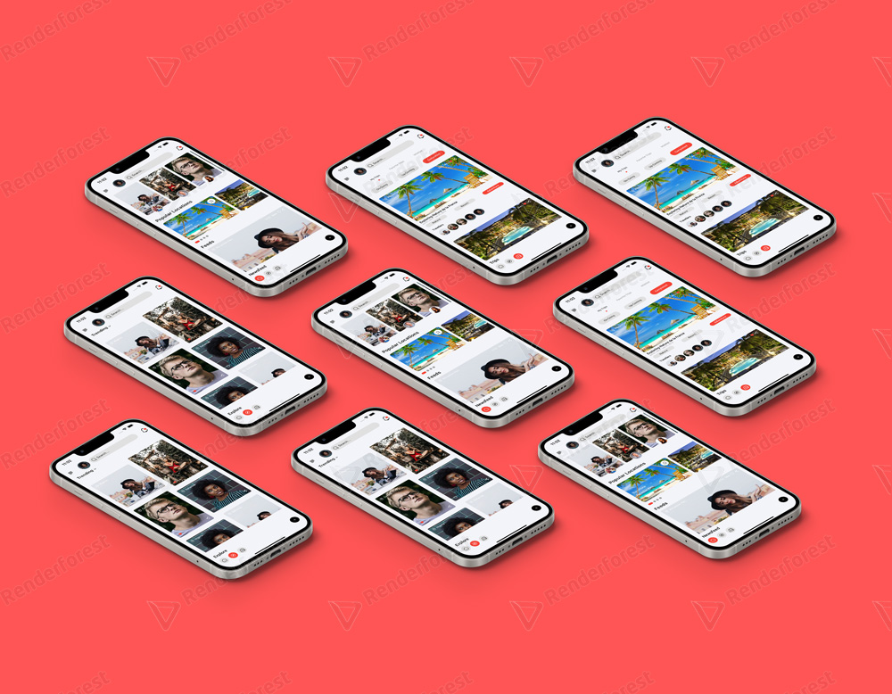
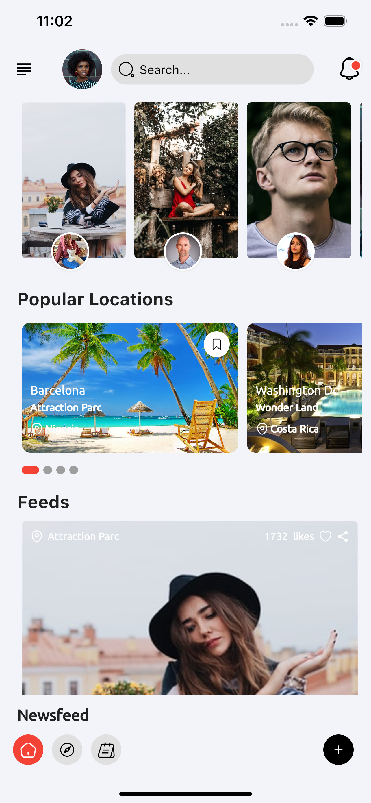
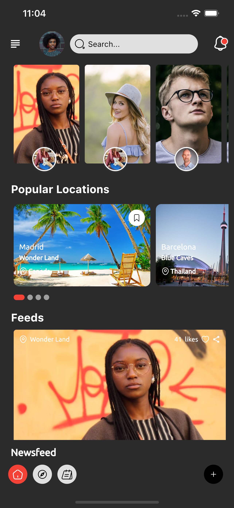
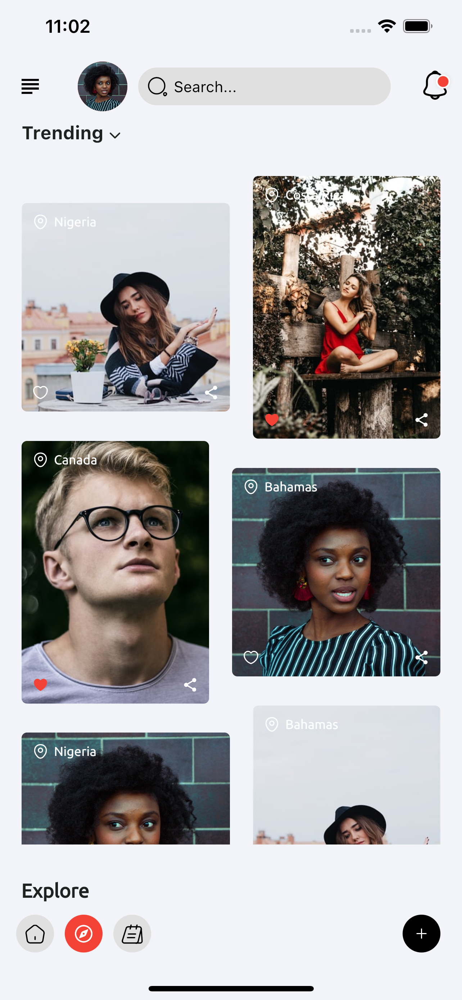
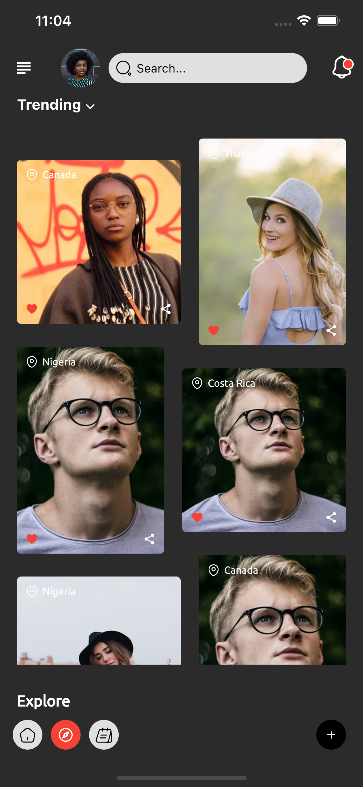
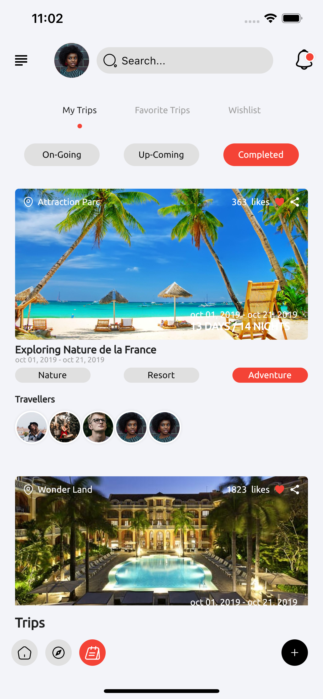
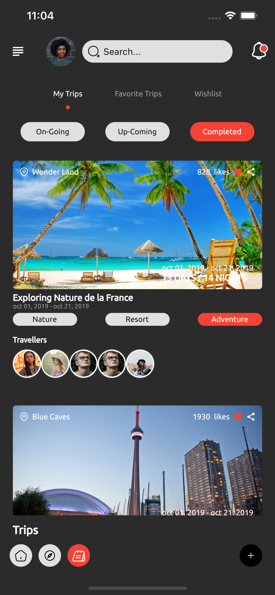
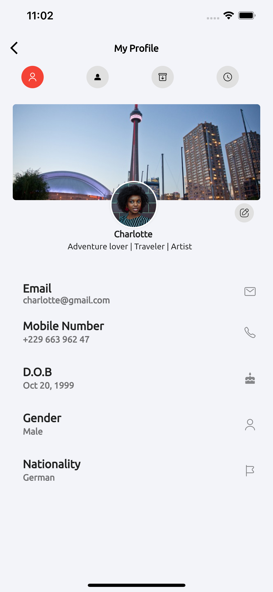
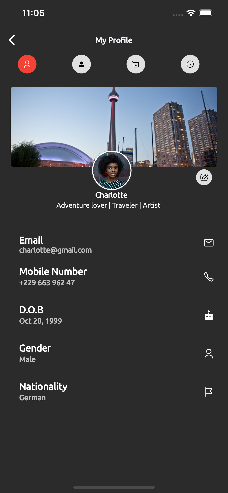

# 🔥🔥 Flutter Traveler's Social App  
Flutter representation of the Traveler's Social App  found on dribbble.

Star⭐ the repo if you like what you see😉.

Images are from [dribbble](https://dribbble.com/shots/11674733-Travellore-App-UI-UX-Modern-Minimal)

-- Let's make 500Stars⭐ on this repo, i will add a firebase backend

## ✨ Requirements
* Any Operating System (ie. MacOS X, Linux, Windows)
* Any IDE with Flutter SDK installed (ie. IntelliJ, Android Studio, VSCode etc)
* A little knowledge of Dart and Flutter
* A brain to think 🤓🤓

## 🌗 Toggle theme
To toggle the theme, change the `theme` variable in `main.dart`.

`Constants.darkTheme` for dark and `Constants.lightTheme` for light.

## 📸 ScreenShots

 
 
 
 

## 🤓 Author(s)
**Charly Keleb Charles042** 

