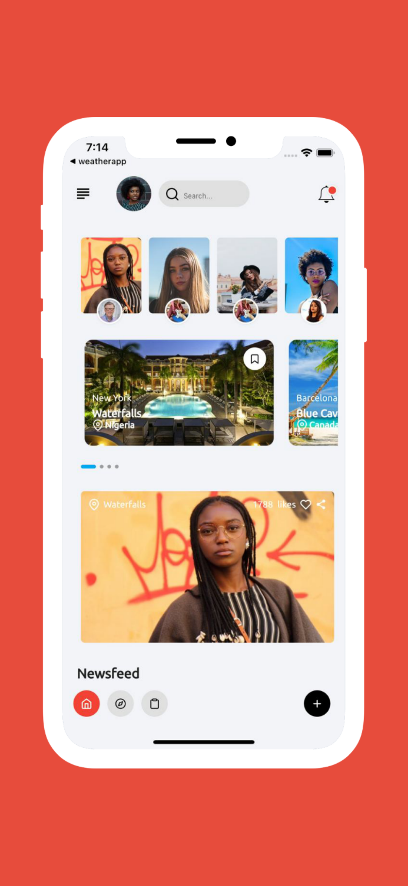
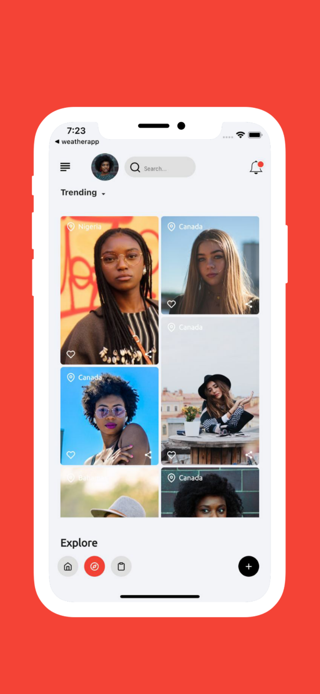
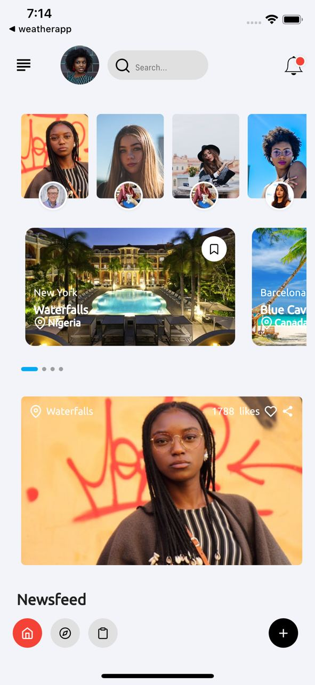
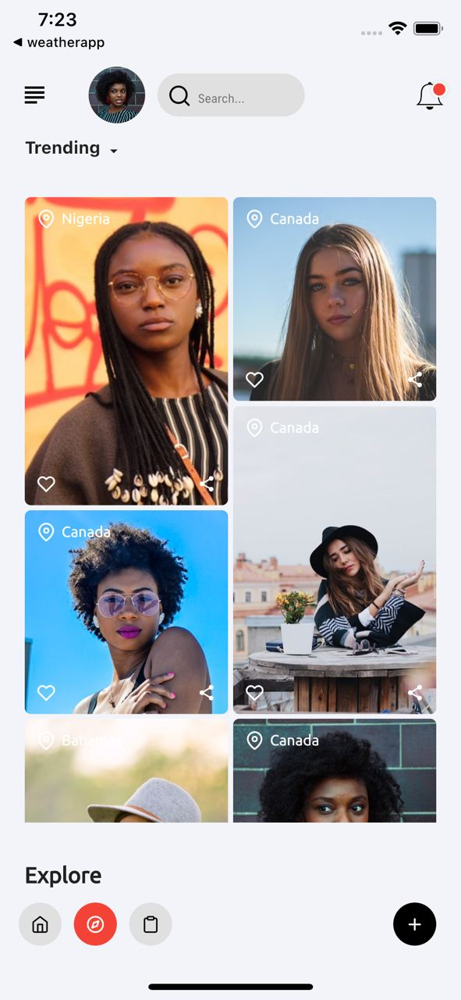
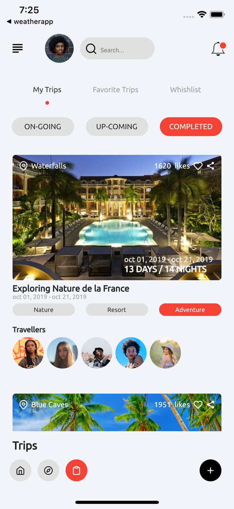
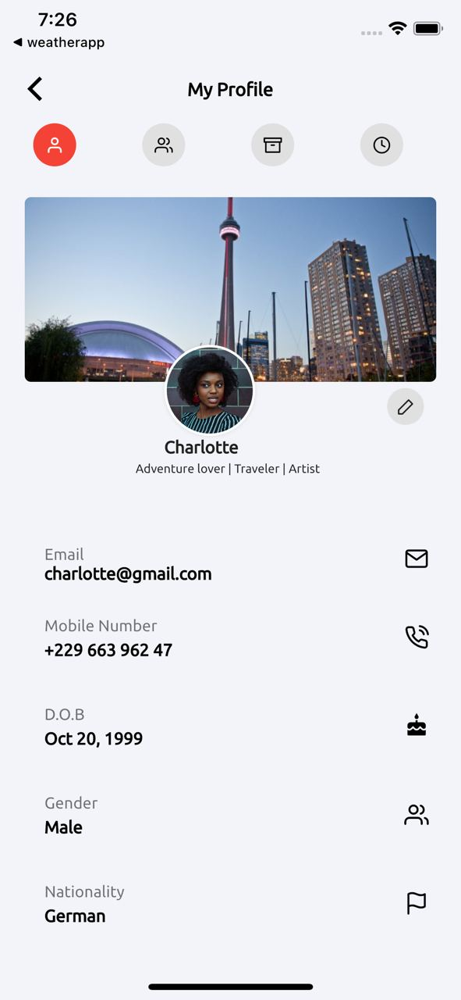
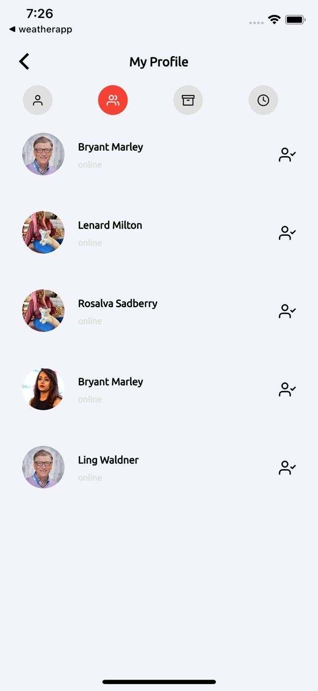

# 🔥🔥 Flutter Traveler's Social App  
Flutter representation of the Traveler's Social App  found on dribbble.

Star⭐ the repo if you like what you see😉.

Images are from [dribbble](https://dribbble.com/shots/11674733-Travellore-App-UI-UX-Modern-Minimal)

## ✨ Requirements
* Any Operating System (ie. MacOS X, Linux, Windows)
* Any IDE with Flutter SDK installed (ie. IntelliJ, Android Studio, VSCode etc)
* A little knowledge of Dart and Flutter
* A brain to think 🤓🤓

## 📸 ScreenShots

 
 

## 🤓 Author(s)
**Charly Keleb Charles042** 

